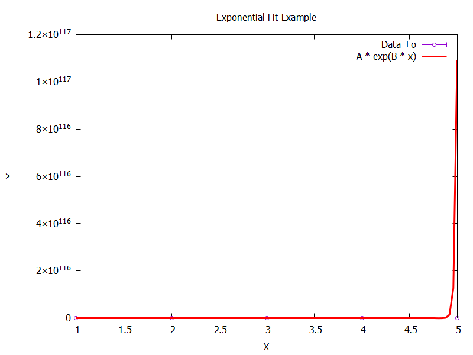
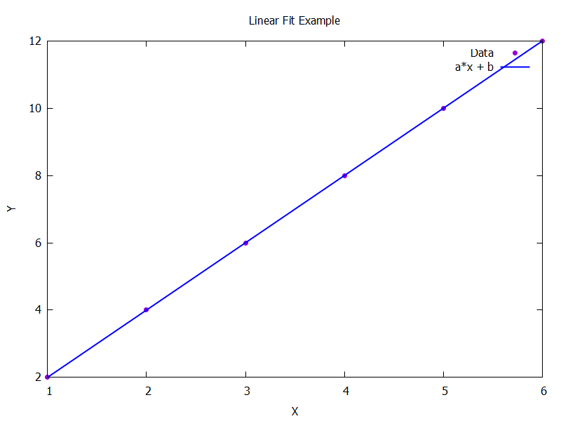
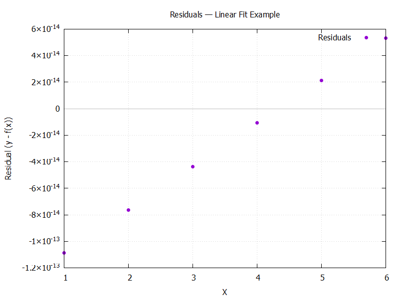

# Plotinator Batch Report
**Date:** 2025-11-08_17-20-15

---

## Exponential Fit Example
**Formula:** `A * exp(B * x)`  
**Parameters:**
| Name | Value | Error |
|------|-------:|------:|
| A | 26.6997 | 2.62612e+24 |
| B | 53.2414 | 1.71692e+22 |

---

## Linear Fit Example
**Formula:** `a*x + b`  
**Parameters:**
| Name | Value | Error |
|------|-------:|------:|
| a | 2 | 0 |
| b | 1.41562e-13 | 0 |

**Residual Metrics:**  
Mean = -2.576e-14 Std = 5.634e-14 RMSE = 6.195e-14

---
