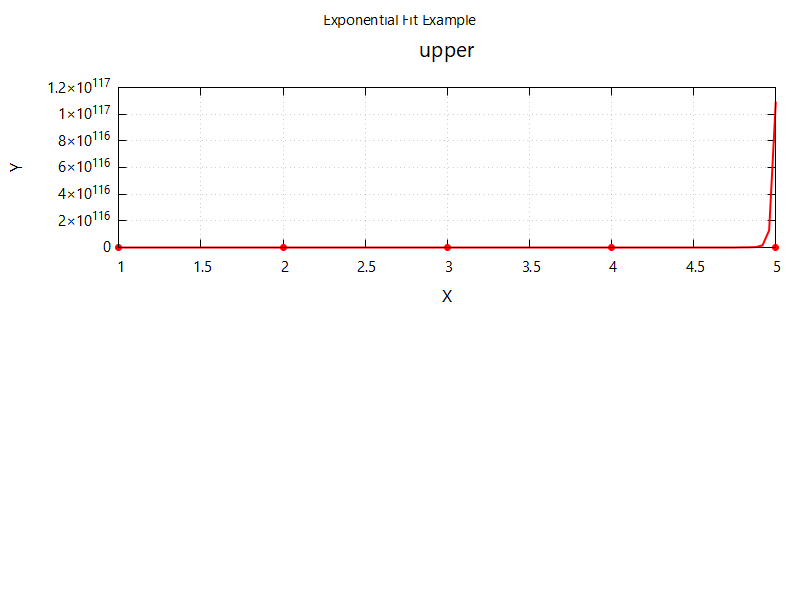

# Plotinator Batch Report
**Date:** 2025-11-15_00-25-23

---

## Exponential Fit Example
**Formula:** `A * exp(B * x)`  
**Parameters:**
| Name | Value | Error |
|------|-------:|------:|
| A | 26.6997 | 3.93919e+24 |
| B | 53.2414 | 2.57538e+22 |

**Data Source:**
- Path: `C:/Projects/Plotinator_10k/data/sample2.dat`
- Columns: x → col 1, y → col 2
- Weight column: col 4
- Rows: 5 / 5 used after preprocessing
- Preprocessing steps:
  - Filter `col2 > 0` → 5 rows

> Fit weighted by column 4

---
